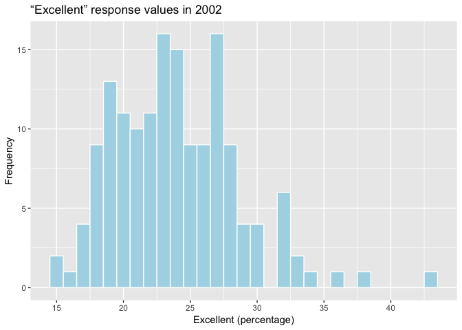
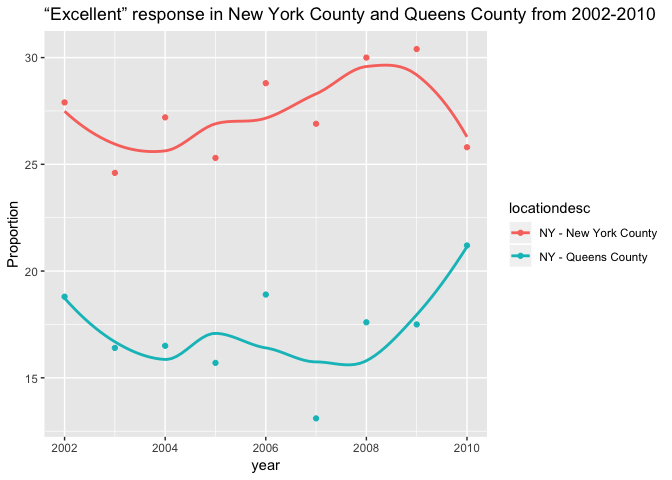

p8105\_hw2\_jz3036
================
Junyuan Zheng (jz3036)
2018-09-30

-   Import necessary packages.

``` r
library(tidyverse)
```

    ## ── Attaching packages ─────────────────────────────────────────────────────────── tidyverse 1.2.1 ──

    ## ✔ ggplot2 3.0.0     ✔ purrr   0.2.5
    ## ✔ tibble  1.4.2     ✔ dplyr   0.7.6
    ## ✔ tidyr   0.8.1     ✔ stringr 1.3.1
    ## ✔ readr   1.1.1     ✔ forcats 0.3.0

    ## ── Conflicts ────────────────────────────────────────────────────────────── tidyverse_conflicts() ──
    ## ✖ dplyr::filter() masks stats::filter()
    ## ✖ dplyr::lag()    masks stats::lag()

``` r
library(readxl)
```

Problem 1
=========

-   Import the raw data for Problem 1.

``` r
data_p1 = 
  read_csv(file='./raw_data/NYC_Transit_Subway_Entrance_And_Exit_Data.csv') %>%
  janitor::clean_names(.) %>%
  select(., line:entry, vending, ada) %>%
  mutate(., entry = recode(entry, YES = TRUE, NO = FALSE))
```

    ## Parsed with column specification:
    ## cols(
    ##   .default = col_character(),
    ##   `Station Latitude` = col_double(),
    ##   `Station Longitude` = col_double(),
    ##   Route8 = col_integer(),
    ##   Route9 = col_integer(),
    ##   Route10 = col_integer(),
    ##   Route11 = col_integer(),
    ##   ADA = col_logical(),
    ##   `Free Crossover` = col_logical(),
    ##   `Entrance Latitude` = col_double(),
    ##   `Entrance Longitude` = col_double()
    ## )

    ## See spec(...) for full column specifications.

``` r
head(data_p1)
```

    ## # A tibble: 6 x 19
    ##   line  station_name station_latitude station_longitu… route1 route2 route3
    ##   <chr> <chr>                   <dbl>            <dbl> <chr>  <chr>  <chr> 
    ## 1 4 Av… 25th St                  40.7            -74.0 R      <NA>   <NA>  
    ## 2 4 Av… 25th St                  40.7            -74.0 R      <NA>   <NA>  
    ## 3 4 Av… 36th St                  40.7            -74.0 N      R      <NA>  
    ## 4 4 Av… 36th St                  40.7            -74.0 N      R      <NA>  
    ## 5 4 Av… 36th St                  40.7            -74.0 N      R      <NA>  
    ## 6 4 Av… 45th St                  40.6            -74.0 R      <NA>   <NA>  
    ## # ... with 12 more variables: route4 <chr>, route5 <chr>, route6 <chr>,
    ## #   route7 <chr>, route8 <int>, route9 <int>, route10 <int>,
    ## #   route11 <int>, entrance_type <chr>, entry <lgl>, vending <chr>,
    ## #   ada <lgl>

-   Variables in the original dataset include division, line, station name, route1-7, entrance type, entry, exit only, vending, staffing, staff hours, ada\_notes, north south street, east west street, corner and station location in **characters**; station latitude longitude, entrance latitude longitude in **double**; route8-11 in **integer**; ada, free crossover in **logical** variable.
-   As the pipeline shown above, after importing the raw data, I use the **janitor::clean\_names()** function to change the column names into snake-shape. Then use the **select()** function to select columns required. Finally, use the **mutate()** and **recode()** function to change the "entry" column into logical variable.
-   The data after cleaning steps includes 1868 rows and 19 columns.
-   As for the column of each variable, I think the data after manipulation is fine, barring route1-11 could potentially be gethered into one route column with route number 1-11. On the other hand, some routes are in charaters and others are in integers, which could be confusing. Besides, since we no longer care about the "entrance location" from original dataset, there are some rows that are identical to others, for which we could probably merge them into one.

``` r
distinct_station = distinct(data_p1, station_name, route1, route2, route3, route4, route5, route6, route7, route8, route9, route10, route11)
```

-   There are **456** distinct stations.

``` r
select_ada = filter(data_p1, ada == TRUE)
```

-   There are **468** stations that are ADA compliant.

``` r
vending_F_entry_T = filter(data_p1, vending == 'NO', entry == TRUE)
```

-   The proportion of station without vending while allow entrance is **0.0369379**.

Reformat data so that route number and route name are distinct variables:

``` r
data_p1_re = 
  gather(data_p1, key = route_number, value = route_name, route1:route11) %>%
  separate(., route_number, into = c('route', 'route_number'), sep = "e") %>%
  select(., -'route')
```

``` r
distinct_station_A =
  filter(data_p1_re, route_name == 'A') %>%
  distinct(., station_name)
```

-   There are **56** distinct stations serve the A train.

``` r
distinct_station_A_ada = filter(data_p1_re, route_name == 'A', ada == 'TRUE')
```

-   There are **107** stations serve the A train and ADA compliant.

Problem 2
=========

-   Read and clean the Mr. Trash Wheel sheet:
-   For data import of problem2 blow, after filtering out rows that have NA in the dumpster column, there were still one row of 'Grand Total' at last. I think it'd be tidier not having that row.

``` r
data_p2 = 
  read_excel('./raw_data/HealthyHarborWaterWheelTotals2017-9-26.xlsx', sheet = 1, range = cell_cols("A:N")) %>% 
  janitor::clean_names(.) %>%
  filter(., !is.na(dumpster), month != 'Grand Total') %>% 
  mutate(., sports_balls = round(sports_balls), sports_balls = as.integer(sports_balls))
head(data_p2, 5)
```

    ## # A tibble: 5 x 14
    ##   dumpster month  year date                weight_tons volume_cubic_ya…
    ##      <dbl> <chr> <dbl> <dttm>                    <dbl>            <dbl>
    ## 1        1 May    2014 2014-05-16 00:00:00        4.31               18
    ## 2        2 May    2014 2014-05-16 00:00:00        2.74               13
    ## 3        3 May    2014 2014-05-16 00:00:00        3.45               15
    ## 4        4 May    2014 2014-05-17 00:00:00        3.1                15
    ## 5        5 May    2014 2014-05-17 00:00:00        4.06               18
    ## # ... with 8 more variables: plastic_bottles <dbl>, polystyrene <dbl>,
    ## #   cigarette_butts <dbl>, glass_bottles <dbl>, grocery_bags <dbl>,
    ## #   chip_bags <dbl>, sports_balls <int>, homes_powered <dbl>

-   Read and clean precipitation data for 2016 and 2017:
-   Omit rows without precipitation data and add a variable year.

``` r
precip_2016 = 
  read_excel('./raw_data/HealthyHarborWaterWheelTotals2017-9-26.xlsx', sheet = 4, range = "A2:B15") %>% 
  janitor::clean_names(.) %>%
  filter(., !is.na(month), !is.na(total)) %>%
  mutate(., year = '2016')
precip_2016
```

    ## # A tibble: 12 x 3
    ##    month total year 
    ##    <dbl> <dbl> <chr>
    ##  1     1  3.23 2016 
    ##  2     2  5.32 2016 
    ##  3     3  2.24 2016 
    ##  4     4  1.78 2016 
    ##  5     5  5.19 2016 
    ##  6     6  3.2  2016 
    ##  7     7  6.09 2016 
    ##  8     8  3.96 2016 
    ##  9     9  4.53 2016 
    ## 10    10  0.62 2016 
    ## 11    11  1.47 2016 
    ## 12    12  2.32 2016

``` r
precip_2017 = 
  read_excel('./raw_data/HealthyHarborWaterWheelTotals2017-9-26.xlsx', sheet = 3, range = "A2:B15") %>% 
  janitor::clean_names(.) %>%
  filter(., !is.na(month), !is.na(total)) %>%
  mutate(., year = '2017')
precip_2017
```

    ## # A tibble: 8 x 3
    ##   month total year 
    ##   <dbl> <dbl> <chr>
    ## 1     1  2.34 2017 
    ## 2     2  1.46 2017 
    ## 3     3  3.57 2017 
    ## 4     4  3.99 2017 
    ## 5     5  5.64 2017 
    ## 6     6  1.4  2017 
    ## 7     7  7.09 2017 
    ## 8     8  4.44 2017

-   Combine datasets and convert month to a character variable (using month.name\[\]):

``` r
comb_16_17 = 
  bind_rows(precip_2016, precip_2017) %>% 
  mutate(., month = month.name[month]) %>% 
  select(., year, month, total)
comb_16_17
```

    ## # A tibble: 20 x 3
    ##    year  month     total
    ##    <chr> <chr>     <dbl>
    ##  1 2016  January    3.23
    ##  2 2016  February   5.32
    ##  3 2016  March      2.24
    ##  4 2016  April      1.78
    ##  5 2016  May        5.19
    ##  6 2016  June       3.2 
    ##  7 2016  July       6.09
    ##  8 2016  August     3.96
    ##  9 2016  September  4.53
    ## 10 2016  October    0.62
    ## 11 2016  November   1.47
    ## 12 2016  December   2.32
    ## 13 2017  January    2.34
    ## 14 2017  February   1.46
    ## 15 2017  March      3.57
    ## 16 2017  April      3.99
    ## 17 2017  May        5.64
    ## 18 2017  June       1.4 
    ## 19 2017  July       7.09
    ## 20 2017  August     4.44

-   For the Mr. Trash Wheel dataset, there are **215 rows (observations)**, **14 columns (variables)** in it. One main part of the data includes that during which time the data were collected, in which the **data** variable is not that tidy partly containing info that're already in the **month** and **year** variables. The other big chunk of the data is about different types of trash it collected, including **plastic\_bottles**, **polystyrene**, **cigarette\_butts**, etc.
-   For precipitation data for 2016 and 2017, there are **20 rows (observations) recorded**, variables including **year**, **month**, and **total** (precipitation). 2017 only have 8 month as far recorded.

what was the total precipitation in 2017?

``` r
total_precip_2017 = 
  filter(comb_16_17, year == 2017) %>%
  .$total %>% 
  sum(.)
```

-   The total precipitation in 2017 is **29.93**.

What was the median number of sports balls in a dumpster in 2016?

``` r
median_balls_2016 = 
  filter(data_p2, year == 2016) %>%
  .$sports_balls %>%
  median(.)
```

-   The median number of sports balls in a dumpster in 2016 is **26**.

Problem 3
=========

-   Import the BRDSS dataset.

``` r
library(p8105.datasets)
data(brfss_smart2010)
```

-   Data manipulation:

``` r
data_p3 = 
  janitor::clean_names(brfss_smart2010) %>%
  filter(., topic == 'Overall Health') %>% 
  select(., -c(class, topic, question, sample_size, confidence_limit_low:geo_location)) %>% 
  spread(., key = response, value = data_value) %>%
  janitor::clean_names(.) %>% 
  select(., year:locationdesc, poor, fair, good, very_good, excellent) %>% 
  mutate(., verygood_excellent_prop = very_good + excellent)
head(data_p3)
```

    ## # A tibble: 6 x 9
    ##    year locationabbr locationdesc  poor  fair  good very_good excellent
    ##   <int> <chr>        <chr>        <dbl> <dbl> <dbl>     <dbl>     <dbl>
    ## 1  2002 AK           AK - Anchor…   5.9   8.6  23.8      33.7      27.9
    ## 2  2002 AL           AL - Jeffer…   5.9  12.1  32.7      30.9      18.5
    ## 3  2002 AR           AR - Pulask…   4.2  12.5  29.9      29.3      24.1
    ## 4  2002 AZ           AZ - Marico…   4.6  10.3  26.9      36.6      21.6
    ## 5  2002 AZ           AZ - Pima C…   3.9   7.5  31.9      30.1      26.6
    ## 6  2002 CA           CA - Los An…   4.5  14.3  28.7      29.8      22.7
    ## # ... with 1 more variable: verygood_excellent_prop <dbl>

How many unique locations are included in the dataset? Is every state represented? What state is observed the most?

``` r
distinct_loc = distinct(data_p3, locationdesc)
```

-   There are **404** distinct locations.

``` r
distinct_state = distinct(data_p3, locationabbr)
```

-   There are **51** distinct states represented, which includes 50 states as well as Washington DC.

``` r
sort(table(data_p3$locationabbr), decreasing=TRUE) 
```

    ## 
    ##  NJ  FL  NC  WA  MD  MA  TX  NY  SC  CO  OH  PA  NE  CA  UT  NH  VT  CT 
    ## 146 122 115  97  90  79  71  65  63  59  59  59  53  52  50  48  48  47 
    ##  LA  NM  OK  KS  RI  MI  MN  OR  AZ  ID  HI  ME  DE  GA  TN  IL  MO  MS 
    ##  45  43  40  38  38  34  33  33  32  32  31  31  27  27  26  25  25  23 
    ##  WY  AR  IN  AL  MT  ND  NV  SD  IA  AK  DC  KY  WI  WV  VA 
    ##  22  21  21  18  18  18  18  18  14  11   9   9   9   9   4

-   from the result above, we can see New Jersey is observed most

``` r
median_excellent_02 = 
  filter(data_p3, year == 2002) %>%
  .$excellent
```

-   In 2002, the median of the “Excellent” response is **23.6**

Make a histogram of “Excellent” response values in the year 2002:

``` r
data_p3_2002 = filter(data_p3, year == 2002)
ggplot(data_p3_2002, aes(x = excellent)) + 
  geom_histogram(binwidth = 1, color="white", fill="lightblue") +
  labs(title="“Excellent” response values in 2002", 
       x="Excellent (percentage)", y="Frequency") +
  scale_x_continuous(breaks = seq(0, 50, 5))
```

    ## Warning: Removed 2 rows containing non-finite values (stat_bin).



Make a scatterplot showing the proportion of “Excellent” response values in New York County and Queens County (both in NY State) in each year from 2002 to 2010:

``` r
scatter_data_NYC = 
  filter(data_p3, year <= 2010, locationdesc == 'NY - New York County')
scatter_data_QC = 
  filter(data_p3, year <= 2010, locationdesc == 'NY - Queens County')

scatter_data = 
  full_join(scatter_data_NYC, scatter_data_QC, by = "year") %>%
  janitor::clean_names(.)

ggplot(scatter_data, aes(x = excellent_x, y = excellent_y)) + 
  geom_point(aes(color = year) ) +
  labs(title="“Excellent” response in New York County and Queens County from 2002-2010", 
       x="New York County", y="Queens County") +
  geom_text(aes(label=year),hjust=0.5, vjust=1.5)
```


